# Securing E-Commerce Infrastructure: Network Security & Defense Implementation for Luna Bags

**Author:** Alister A. Rodrigues
**Date:** May 2025
**Lab Environment:** Docker / SEED Ubuntu VM
**Tools:** Apache, OpenSSL, iptables, WireGuard, Fail2Ban, ModSecurity, OWASP CRS, nmap, hping3

---

## Executive Summary

Luna Bags, a growing e-commerce retailer of eco-friendly bags, engaged this security implementation to protect their digital infrastructure during a full migration from brick-and-mortar to online operations. The engagement required securing a public-facing web server, enforcing strict network zone isolation, enabling secure remote access, and deploying application-layer protection against web-based attacks — all against a baseline environment with zero existing security controls.

The implementation delivers a six-layer defense-in-depth architecture across a Docker-based lab environment that mirrors a realistic enterprise network topology. Each layer was verified through automated scripts that simulate actual attack behavior and confirm defenses are functioning as intended.

Key outcomes: HTTP traffic forced to HTTPS with full security header suite, Telnet eliminated network-wide across all containers, firewall default-deny policy enforced with 14 distinct attack mitigations, WireGuard VPN providing the only authenticated path from DMZ to internal network, Fail2Ban banning brute force and scanner activity before it reaches the application, and ModSecurity OWASP CRS blocking SQL injection, XSS, path traversal, and RCE attempts at the application layer with HTTP 403 — all fully logged and auditable.

The full architecture and trust boundary design is documented in:
→ [docs/architecture.md](../docs/architecture.md)
→ [docs/threat_model.md](../docs/threat_model.md)

---

## Network Architecture

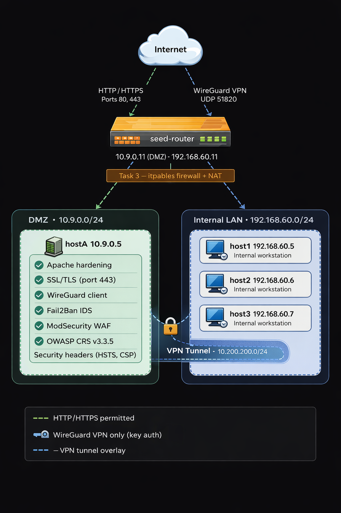
*Figure 1 — Luna Bags lab network topology. DMZ (10.9.0.0/24) hosts the hardened web server. The internal LAN (192.168.60.0/24) is reachable only via WireGuard VPN through seed-router. All inbound internet traffic is filtered by iptables before reaching any zone.*

| Segment | CIDR | Purpose |
|---|---|---|
| DMZ | 10.9.0.0/24 | Public-facing web server |
| Internal | 192.168.60.0/24 | Business workstations |
| VPN Tunnel | 10.200.200.0/24 | Authenticated cross-zone access only |

---

## Task 1: Apache Web Server Hardening

### Implementation

Apache 2.4 was installed and hardened on hostA through `start_apache.sh`, which runs automatically on container startup. The hardening approach minimizes the attack surface exposed to external clients before any request is processed.

**Server information suppression** (`lunabags-global.conf`):
```apache
ServerTokens Prod
ServerSignature Off
TraceEnable Off
```
`ServerTokens Prod` strips version and OS information from the `Server:` response header — attackers use this for vulnerability fingerprinting. `TraceEnable Off` blocks HTTP TRACE, which can be abused for cross-site tracing attacks against authenticated sessions.

**HTTP to HTTPS redirect** (port 80 virtual host):
```apache
<VirtualHost *:80>
    ServerName 10.9.0.5
    Redirect permanent / https://10.9.0.5/
</VirtualHost>
```
All HTTP traffic receives a permanent 301 redirect before any content is served. No customer data ever travels unencrypted.

**Directory listing disabled** (HTTPS virtual host):
```apache
<Directory /var/www/html>
    Options -Indexes
</Directory>
```
Without this, Apache would return a browsable file listing for any directory lacking an `index.html`. This gives attackers a free inventory of server contents.

**Six security headers** on all HTTPS responses:
```apache
Header always set Strict-Transport-Security "max-age=31536000; includeSubDomains; preload"
Header always set X-Frame-Options "DENY"
Header always set X-Content-Type-Options "nosniff"
Header always set X-XSS-Protection "1; mode=block"
Header always set Referrer-Policy "strict-origin-when-cross-origin"
Header always set Content-Security-Policy "default-src 'self'"
```

The `always` keyword sends headers on every response including error pages (403, 500). Without it, error responses bypass the headers entirely. For the full rationale on each header, see → [docs/security_headers.md](../docs/security_headers.md).

### Verification — What the Script Tests

`verify_apache.sh` runs 8 tests from inside the Docker environment:

1. **Container health** — confirms seed-router and hostA are running before any tests begin.
2. **HTTP redirect** — fires `curl http://10.9.0.5/` from seed-router (simulating an internet client) and confirms the response is HTTP 301. A 200 here would mean traffic is served unencrypted.
3. **HTTPS responds** — fires `curl -k https://10.9.0.5/` and confirms HTTP 200. Validates Apache is serving on 443 with TLS active.
4. **Location header** — extracts the `Location:` header from the HTTP response and confirms it points to `https://10.9.0.5/`. Validates the redirect is not just a response code but also directing the client to the correct HTTPS URL.
5. **Apache process running** — runs `pgrep apache2` inside hostA to confirm worker processes are active.
6. **Server header clean** — extracts the `Server:` header and confirms it does not contain a version number (`Apache/[0-9]`). A version string here would mean `ServerTokens Prod` is not applied.
7. **All six security headers present** — checks the HTTPS response headers for each of the six required headers with their correct values. Any missing header is named in the failure output.
8. **Directory listing blocked** — requests `https://10.9.0.5/no_index_here/` (an empty directory with no index file) and confirms the response is 403 with no "Index of" content in the body. This is an attack simulation — it replicates what a directory enumeration tool would do.

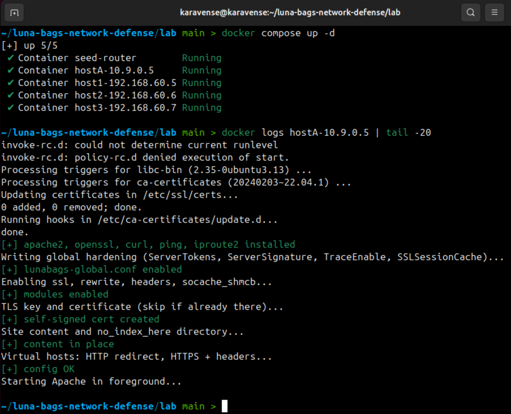
*start_apache.sh container output: package install, global hardening, TLS cert generation, virtual host configuration, Apache started in foreground*

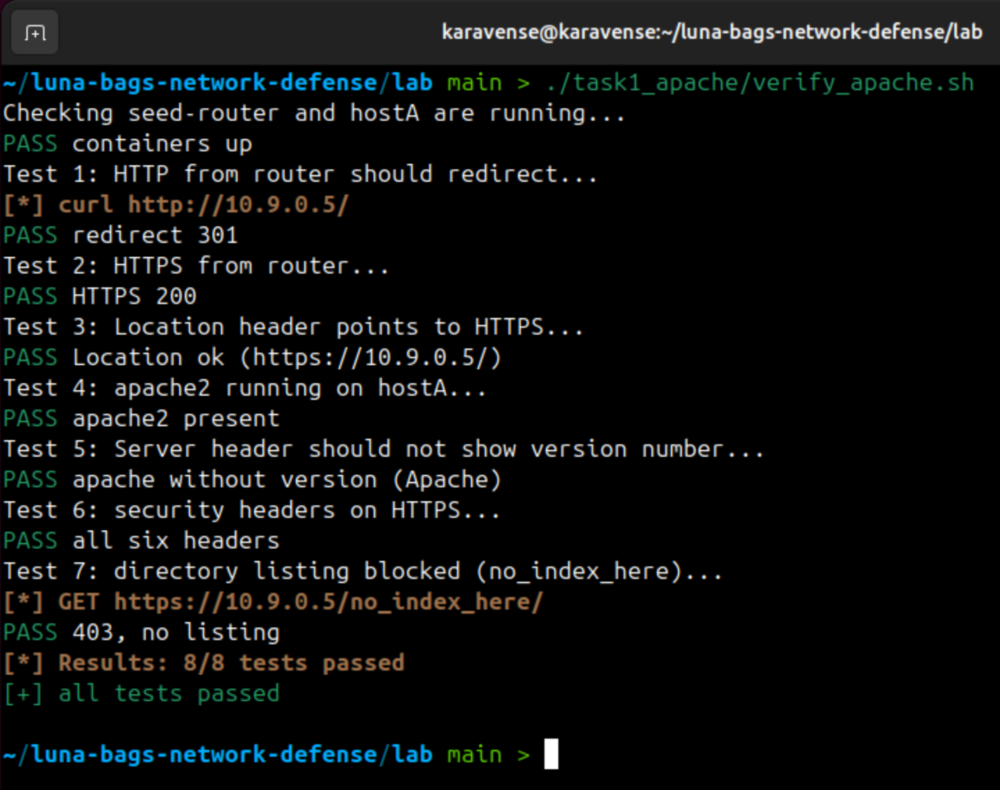
*verify_apache.sh: 8/8 tests passed*

---

## Task 2: SSL/TLS Certificate

### Implementation

A self-signed 2048-bit RSA certificate was generated using OpenSSL and configured on Apache's port 443 virtual host:

```bash
openssl req -x509 -nodes -days 365 -newkey rsa:2048 \
  -keyout /etc/apache2/ssl/lunabags.key \
  -out /etc/apache2/ssl/lunabags.crt \
  -subj "/C=US/ST=New York/L=New York/O=Luna Bags/OU=IT/CN=10.9.0.5"
```

The private key is stored at permissions `600` (root-readable only). SSL session caching (`SSLSessionCache shmcb`) reduces handshake overhead under concurrent load. The implementation is idempotent — if the key and certificate already exist, they are not regenerated.

Self-signed certificates provide identical encryption to CA-signed certificates. The only difference is the trust chain — browsers will display a warning on first visit. A production deployment replaces this with Let's Encrypt or an organization CA.

### Verification — What the Script Tests

`verify_ssl.sh` runs 6 tests:

1. **Container health** — confirms both containers are running.
2. **HTTPS from localhost** — fires `curl -sk https://localhost/` from inside hostA and confirms HTTP 200. Tests that Apache's SSL vhost is bound and serving locally.
3. **HTTPS from router** — fires `curl -k https://10.9.0.5/` from seed-router and confirms HTTP 200. Validates the certificate and SSL configuration accept external connections.
4. **Certificate subject** — runs `openssl x509 -noout -subject` against the certificate file on hostA and checks for `CN=10.9.0.5` and `O=Luna Bags`. Confirms the certificate was generated with the correct organization details.
5. **SSL module loaded** — runs `apache2ctl -M` inside hostA and confirms `ssl_module` is listed. If the module is not loaded, Apache would silently fall back to HTTP-only.
6. **Certificate not expired** — runs `openssl x509 -checkend 0` against the certificate and confirms it has not expired. The `-checkend 0` flag checks whether the certificate expires within the next 0 seconds — i.e., right now.

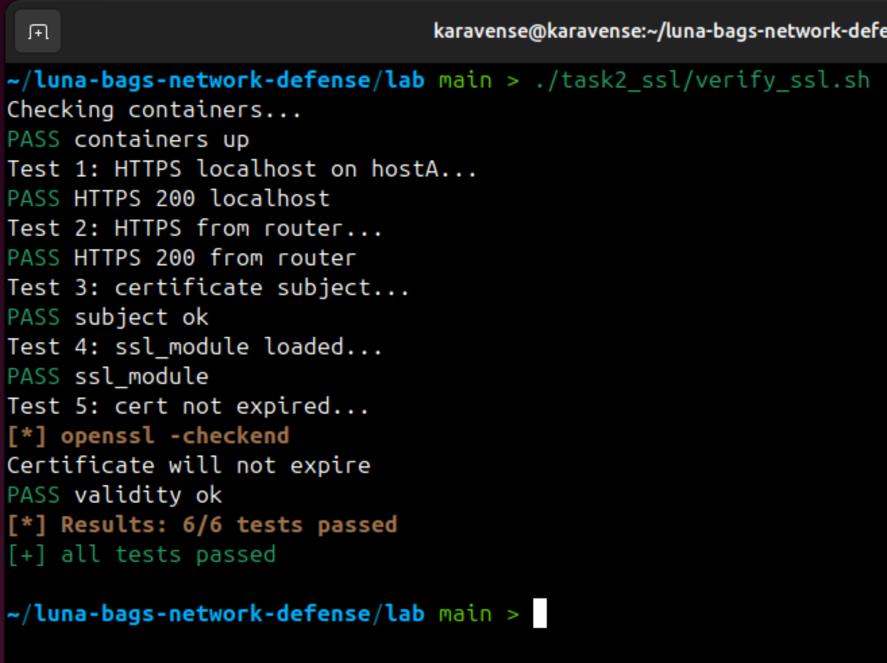
*verify_ssl.sh: 6/6 tests passed — HTTPS connectivity confirmed, certificate subject and validity verified*

---

## Task 3: iptables Firewall

### Design

The firewall implements default-deny across both INPUT and FORWARD chains. The implementation runs in two phases. For the full access control policy, see → [lab/task3_firewall/access_control_policies.md](../lab/task3_firewall/access_control_policies.md).

**Phase 1** applies to all five containers individually. On Docker containers, the nf_tables module used by the default `iptables` binary may not be available, so the script detects and uses `iptables-legacy` (the older x_tables interface) where needed. Phase 1 applies:
- Telnet disabled: `inetd` stopped, `telnet` line commented in `/etc/inetd.conf`, REJECT rule on port 23
- SYN flood limiting: 10/s, burst 20
- ICMP echo rate limiting: 1/s, burst 3
- SSH brute force: 4 attempts per 60 seconds → DROP

**Phase 2** runs on seed-router (privileged container with full iptables access). Default policies set to DROP. A notable implementation detail: the ICMP rate limiting rule on the FORWARD chain is placed **before** the ESTABLISHED/RELATED rule, scoped to `INT_IF` (the internal interface). This is deliberate — conntrack marks rapid pings in the same flow as ESTABLISHED after the first exchange, which would bypass a rate limit placed after the ESTABLISHED/RELATED rule.

**Attack mitigations on router:**
- NULL / FIN / Xmas / ALL-flags / SYN+FIN / SYN+RST scan detection → DROP
- Fragmented packets → DROP
- RFC1918 source spoofing on INPUT → DROP
- DNS amplification (UDP/53 over 512 bytes) → DROP
- SYN flood to hostA: hashlimit 40/s, burst 80 → excess DROP
- ICMP flood from internal: hashlimit 2/s, burst 5 → excess DROP
- Reverse shell ports 4444–4555 → DROP both directions
- All drops logged with `IPTables-Input-Dropped:` / `IPTables-Forward-Dropped:` prefix

### Verification — What the Script Tests

`verify_firewall.sh` runs 10 tests. Tools (hping3, nmap, nc, curl) are installed inside the containers at the start of the script:

1. **HTTP from router** — `curl http://10.9.0.5/` from seed-router expects 301/302. Confirms the firewall forwards HTTP to the web server.
2. **HTTPS from router** — `curl -k https://10.9.0.5/` expects 200. Confirms HTTPS also reaches the web server through the firewall.
3. **HTTP from internal** — same curl from host1 (192.168.60.5) to hostA. Confirms the internal→DMZ HTTP rule is working.
4. **DMZ→internal ping blocked** — `ping -c 5` from hostA to 192.168.60.5. Expects 100% packet loss. This is the zone isolation test — a failure here means the DMZ→Internal DROP rule is missing or misconfigured.
5. **Telnet blocked on all hosts** — attempts `bash /dev/tcp/<ip>/23` to each of the 6 lab IPs from the router. Expects connection failure on all. Tests both the Phase 1 host-level REJECT rules and the Phase 2 router FORWARD REJECT.
6. **Internal→internet reachability** — `curl http://example.com/` from host1. Expects HTTP 200/301. Confirms the internal→internet FORWARD rules and NAT masquerade are working.
7. **NULL scan filtered** — `nmap -sN -p 80 -Pn 10.9.0.5` from host1. A NULL scan sends TCP packets with no flags set — a normal open port responds with RST, a filtered port doesn't respond. The test passes if nmap does not report `80/tcp open` without the `|filtered` qualifier, meaning the firewall is silently dropping null packets.
8. **ICMP flood rate limited** — `hping3 --icmp -c 120 -i u2000` from host1 to hostA. Sends 120 pings at 2ms intervals. Expects fewer than 12 replies (< 10%). Confirms the hashlimit ICMP rate limit on the FORWARD chain.
9. **SYN flood logged/limited** — `hping3 -S -p 443 -c 200 -i u100` from host1. Checks both that fewer than 40 replies are received (rate limiting working) and that `IPTables-Forward-Dropped:` entries appear in the router's kernel log. Either condition passing is sufficient.
10. **Reverse shell port blocked** — `nc -zv 10.9.0.5 4444` from host1. Expects the connection to fail. Confirms the 4444–4555 FORWARD DROP rule.

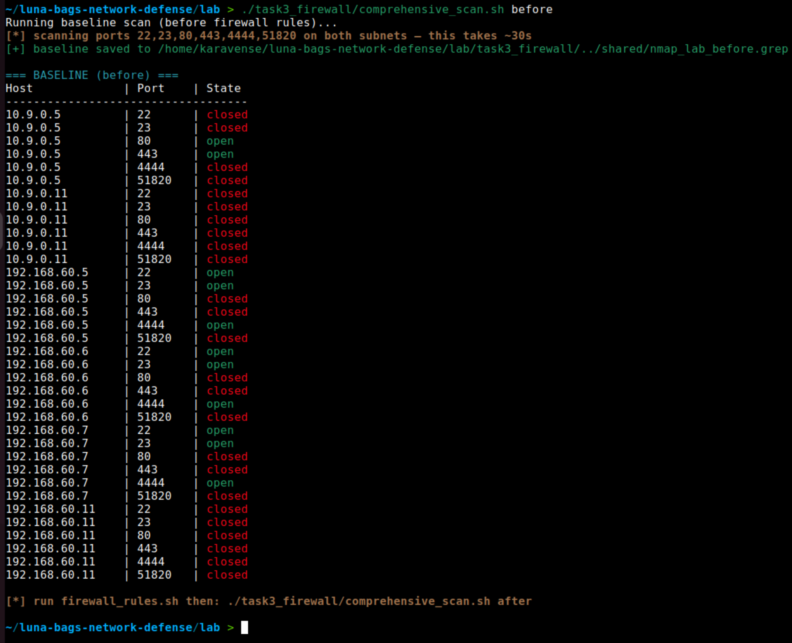
*comprehensive_scan.sh before: baseline showing open ports across lab hosts before firewall rules applied*

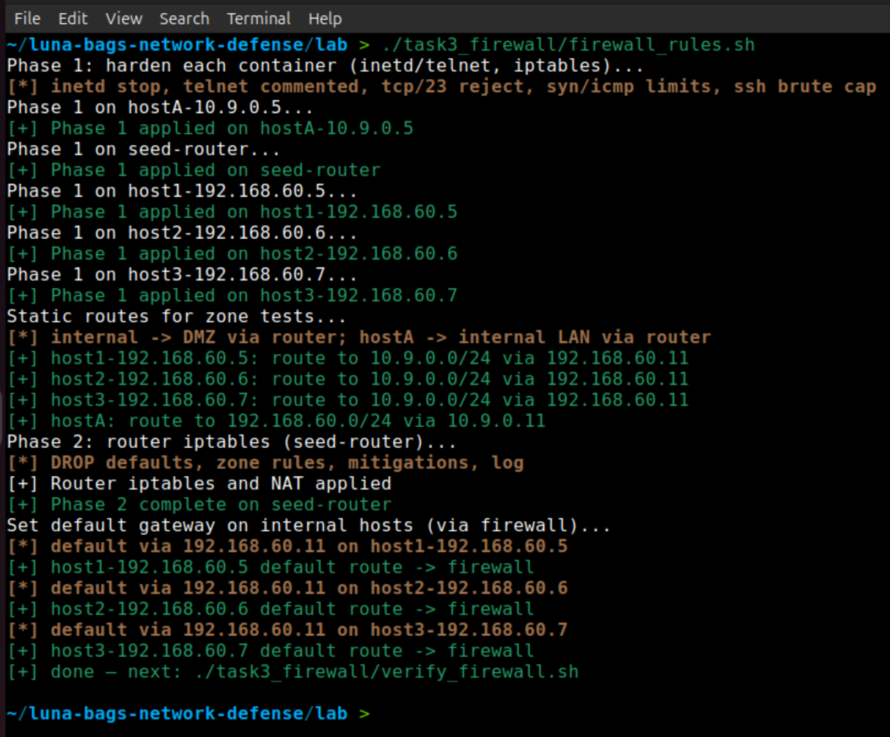
*firewall_rules.sh: Phase 1 applied to all 5 containers, Phase 2 router policy configured*

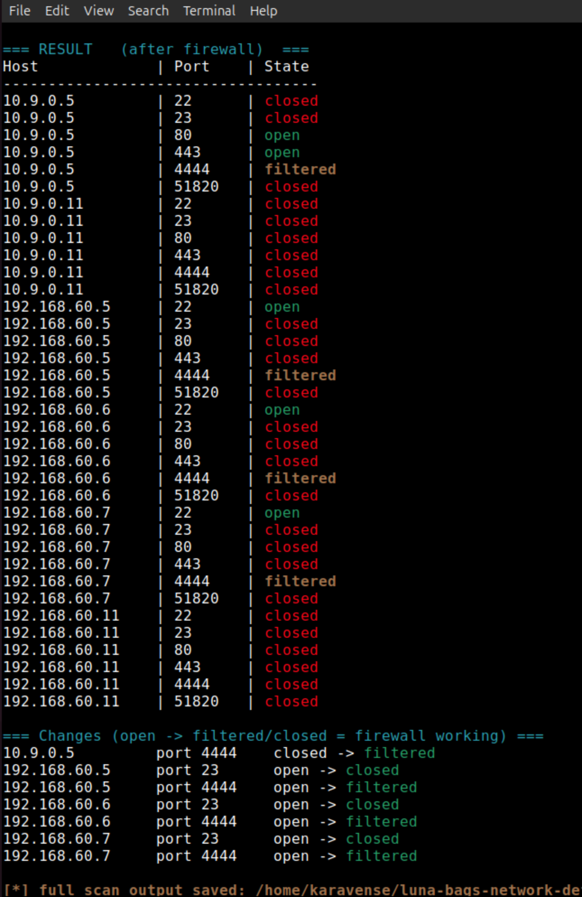
*comprehensive_scan.sh after: color-coded comparison — ports previously open now filtered or closed*

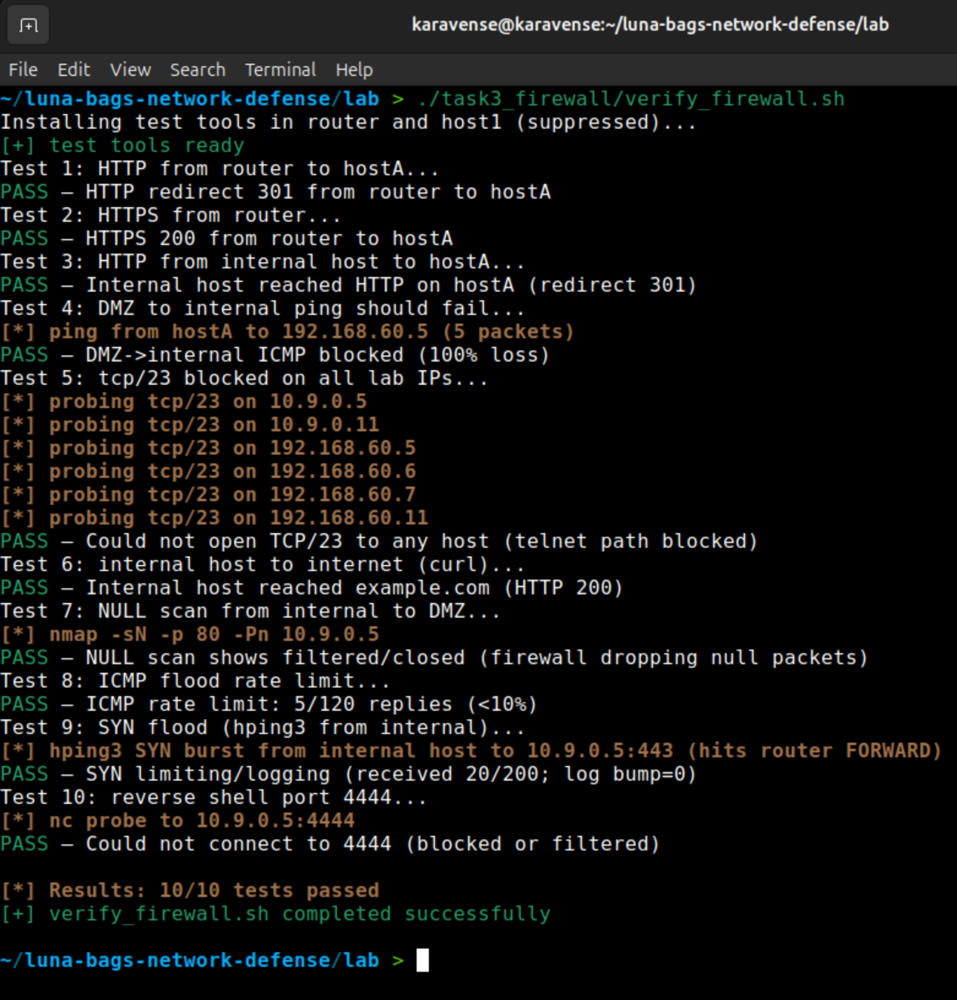
*verify_firewall.sh: 10/10 tests passed*

---

## Task 4: WireGuard VPN

### Design

WireGuard was chosen over OpenVPN for its dramatically smaller codebase (~4,000 lines vs ~70,000), which means a smaller attack surface and faster key exchange. It is now the standard recommendation for Linux VPN deployments.

The tunnel connects seed-router (server, `10.200.200.1`) and hostA (client, `10.200.200.2`). On the client side, `AllowedIPs = 192.168.60.0/24` routes only internal network traffic through the VPN — all other traffic continues normally. This prevents the VPN from becoming an unintended default gateway.

**Server wg0.conf (router):**
```ini
[Interface]
Address = 10.200.200.1/24
ListenPort = 51820
PrivateKey = <server_private_key>

[Peer]
PublicKey = <client_public_key>
AllowedIPs = 10.200.200.2/32
```

**Client wg0.conf (hostA):**
```ini
[Interface]
Address = 10.200.200.2/24
PrivateKey = <client_private_key>

[Peer]
PublicKey = <server_public_key>
Endpoint = 10.9.0.11:51820
AllowedIPs = 192.168.60.0/24
PersistentKeepalive = 25
```

The firewall was updated with two additional rules: `INPUT ACCEPT udp --dport 51820` (allow VPN traffic to reach the router) and a FORWARD rule inserting `wg0 → 192.168.60.0/24 ACCEPT` to allow tunneled traffic to reach internal hosts.

### Verification — What the Script Tests

`verify_vpn.sh` runs 6 tests:

1. **Container health** — both seed-router and hostA running.
2. **wg0.conf on router** — `test -f /etc/wireguard/wg0.conf`. Confirms configure step completed.
3. **wg0.conf on hostA** — same check on the client side.
4. **Route to internal network** — `ip route show | grep 192.168.60.0/24` on hostA. Confirms the VPN client has a route through the tunnel to the internal subnet.
5. **Ping host1 via VPN** — `ping -c 2 192.168.60.5` from hostA. Expects 0% packet loss. Confirms the tunnel is up and traffic reaches the internal network.
6. **Ping host2 via VPN** — same for 192.168.60.6. Tests that the tunnel handles multiple destinations correctly.

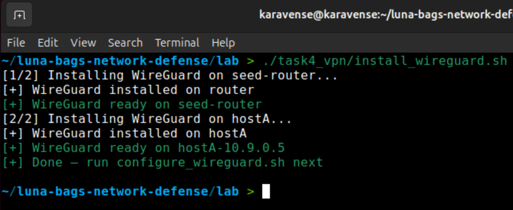
*install_wireguard.sh: WireGuard packages installed on router and hostA, IP forwarding enabled*

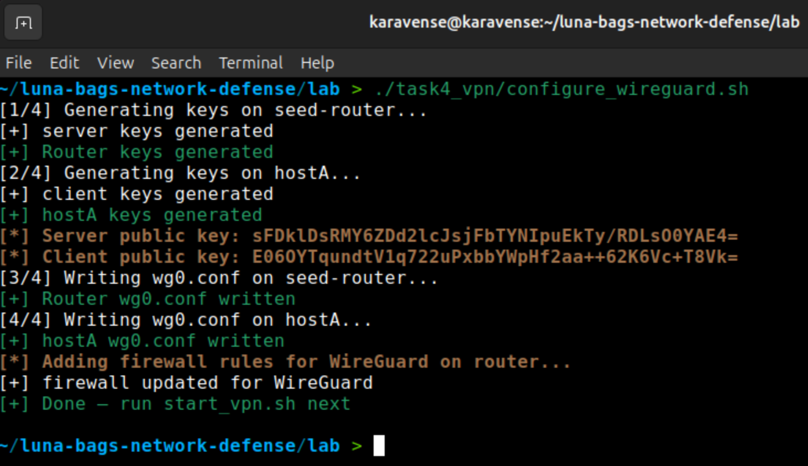
*configure_wireguard.sh: cryptographic keys generated on both sides, wg0.conf written, firewall updated for UDP 51820*

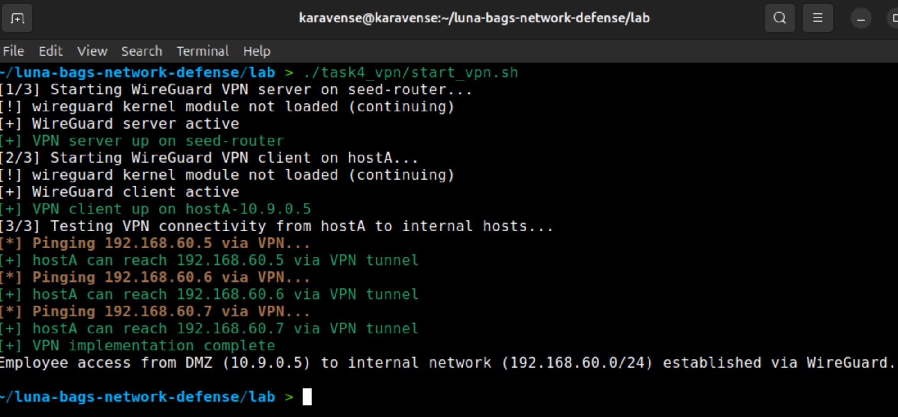
*start_vpn.sh: WireGuard interfaces brought up, ping tests to all three internal hosts via tunnel — 0% packet loss*

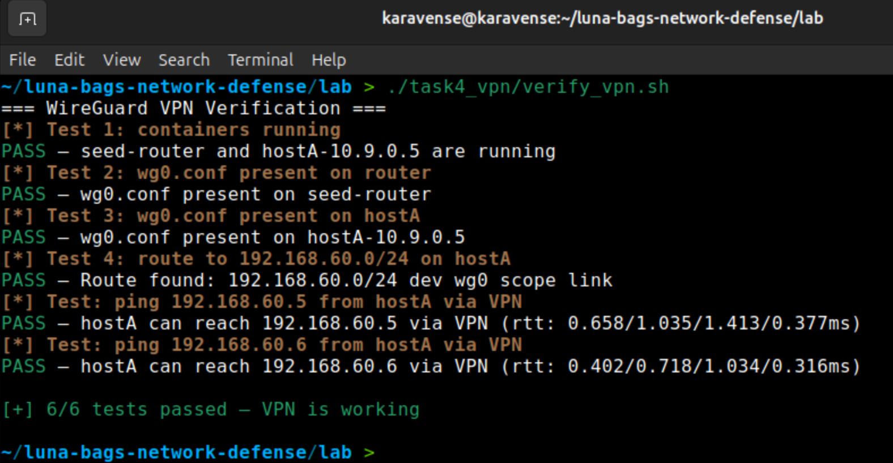
*verify_vpn.sh: 6/6 tests passed — config present, route exists, internal hosts reachable*

---

## Task 5: Fail2Ban Intrusion Detection

### Design

iptables operates on individual packets and cannot read application logs. Fail2Ban bridges this gap: it monitors log files for attack patterns and dynamically inserts iptables ban rules when thresholds are exceeded. This catches attacks that are individually valid at the packet level but malicious in aggregate.

Fail2Ban was deployed on both hostA (Apache jails) and seed-router (SSH jail). The `jail.local` configuration was written identically to both containers.

**Active jails:**

| Jail | Log Source | Threshold | Ban Time | What It Catches |
|---|---|---|---|---|
| sshd | `/var/log/auth.log` | 3 failures / 60s | 300s | SSH brute force |
| apache-auth | `/var/log/apache2/error.log` | 5 failures / 60s | 600s | HTTP auth failures |
| apache-badbots | `/var/log/apache2/access.log` | 1 hit | 86400s | Known scanner UAs |
| apache-noscript | `/var/log/apache2/access.log` | 5 hits / 60s | 300s | Script/cgi probing |

The `apache-badbots` jail is particularly effective: a single request with a known scanner user-agent (nikto, sqlmap, etc.) results in a 24-hour ban before any further reconnaissance is possible.

### Verification — What the Script Tests

`verify_fail2ban.sh` runs 6 tests:

1. **Container health** — both containers running.
2. **Fail2Ban running on hostA** — `fail2ban-client ping` returns `pong`. Confirms the Fail2Ban server process is active.
3. **Fail2Ban running on router** — same check on seed-router.
4. **All jails active on hostA** — `fail2ban-client status` lists all four jail names. Confirms `jail.local` was loaded and each jail started without error.
5. **All jails active on router** — same check on seed-router.
6. **apache-badbots bans on UA match** — unbans the router IP first (to reset state), then sends `curl -A 'nikto'` from seed-router to hostA, waits 5 seconds for the log to be processed, then checks `fail2ban-client status apache-badbots` for the router's IP in the banned list. This is an end-to-end attack simulation: it confirms the full Fail2Ban pipeline — HTTP request → Apache access log → Fail2Ban filter match → iptables ban insertion.

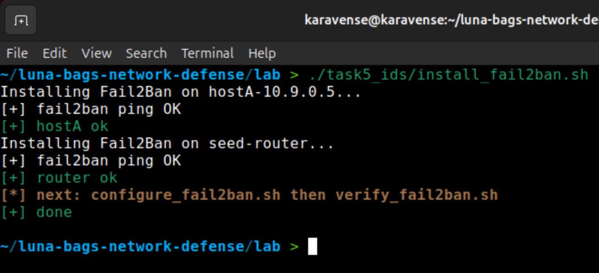
*install_fail2ban.sh: Fail2Ban installed on hostA and seed-router, service started*

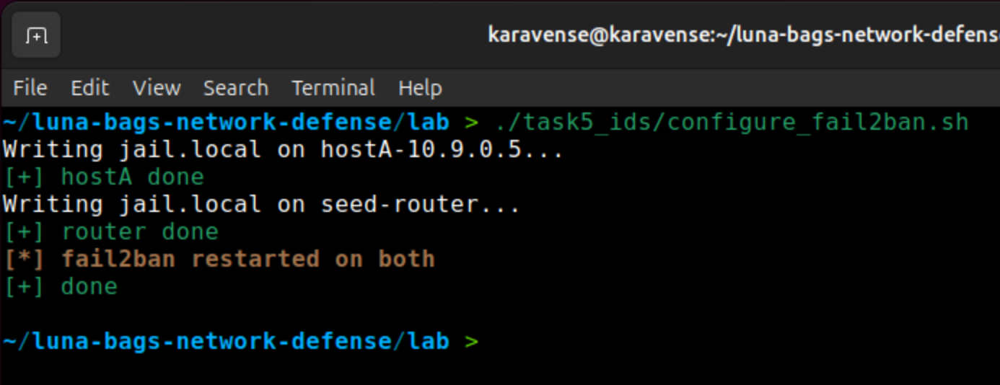
*configure_fail2ban.sh: jail.local written to both containers, all four jails configured, Fail2Ban reloaded*

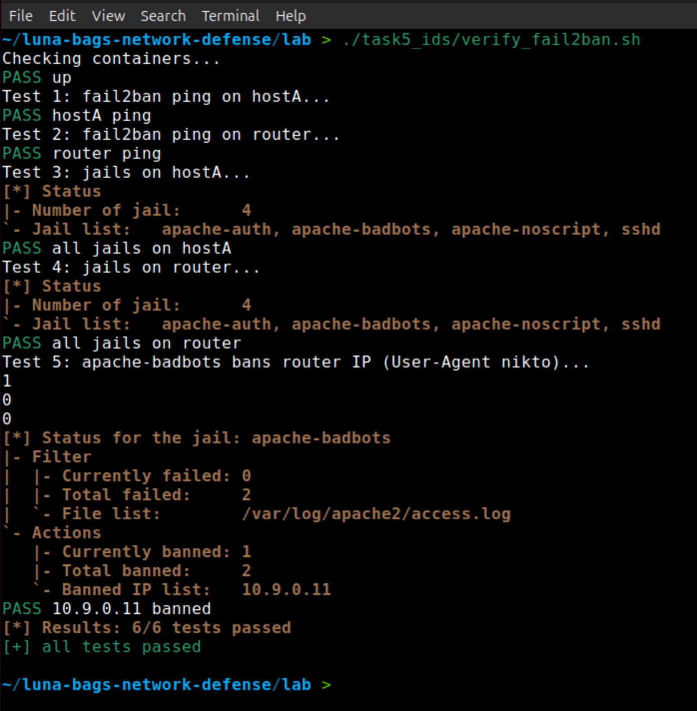
*verify_fail2ban.sh: 6/6 tests — all jails active, nikto UA triggers apache-badbots ban confirmed*

---

## Task 6: ModSecurity WAF + OWASP Core Rule Set

### Design

iptables operates at Layer 3/4. A syntactically valid HTTPS request to port 443 passes the firewall regardless of what the URL parameters contain. ModSecurity operates inside Apache at Layer 7 — it inspects every request before Apache processes it, matching against the OWASP Core Rule Set's 900+ rules covering every major web attack category.

ModSecurity was installed as an Apache module (`libapache2-mod-security2`) with OWASP CRS v3.3.5. CRS v3.3.x was selected over v4 for compatibility with the `libapache2-mod-security2` package version in Ubuntu 22.04's repositories.

**Key configuration (`/etc/modsecurity/modsecurity.conf`):**
```apache
SecRuleEngine On
SecRequestBodyAccess On
SecResponseBodyAccess On
SecAuditLog /var/log/apache2/modsec_audit.log
SecAuditLogParts ABIJDEFHZ
SecAuditLogType Serial
```

`SecRuleEngine On` sets enforcement mode — matched requests are blocked with HTTP 403. `SecAuditLogParts ABIJDEFHZ` captures the request line, headers, response headers, matched rule details, and producer info in the audit log.

**CRS configuration (`crs-setup.conf`):**
```apache
SecDefaultAction "phase:2,log,auditlog,deny,status:403"
```
Paranoia level 1 (production baseline) — broad coverage with minimal false positives.

**Attack types blocked:**

| Attack | CRS Rule File | Example Payload |
|---|---|---|
| SQL Injection | REQUEST-942-APPLICATION-ATTACK-SQLI | `?id=1' OR '1'='1` |
| Cross-Site Scripting | REQUEST-941-APPLICATION-ATTACK-XSS | `?q=<script>alert(1)</script>` |
| Path Traversal / LFI | REQUEST-930-APPLICATION-ATTACK-LFI | `/../../../../etc/passwd` |
| Scanner Detection | REQUEST-913-SCANNER-DETECTION | `User-Agent: nikto` |
| Remote Code Execution | REQUEST-932-APPLICATION-ATTACK-RCE | `?cmd=;cat /etc/passwd` |

### The Audit Log

Each blocked request generates a complete audit log entry. The entry for the RCE test (`?cmd=;cat%20/etc/passwd`) shows:

```
[30/Mar/2026:19:39:49] 10.9.0.11 -> 10.9.0.5:80
GET /?cmd=;cat%20/etc/passwd HTTP/1.1

HTTP/1.1 403 Forbidden

Message: Access denied with code 403 (phase 2).
  Matched phrase "etc/passwd" at ARGS:cmd.
  [file "REQUEST-930-APPLICATION-ATTACK-LFI.conf"] [line "97"] [id "930120"]
  [msg "OS File Access Attempt"] [severity "CRITICAL"]
  [ver "OWASP_CRS/3.3.2"] [tag "attack-lfi"] [tag "PCI/6.5.4"]

Engine-Mode: "ENABLED"
```

This confirms: enforcement mode is active, the correct CRS rule fired (`930120` — OS File Access Attempt), the matched data is recorded (`etc/passwd found within ARGS:cmd`), and the request was blocked in phase 2 before Apache processed it.

### Verification — What the Script Tests

`verify_waf.sh` runs 7 tests, all fired from seed-router using curl against `http://10.9.0.5`:

1. **Normal request passes** — `GET http://10.9.0.5/` expects HTTP 200. Confirms WAF is not blocking legitimate traffic (ModSecurity is blocking attacks, not everything).
2. **SQLi blocked** — `?id=1%27%20OR%20%271%27%3D%271` (URL-encoded `?id=1' OR '1'='1`) expects 403. Tests CRS REQUEST-942 SQLi rules.
3. **XSS blocked** — `?q=%3Cscript%3Ealert(1)%3C/script%3E` (URL-encoded `<script>alert(1)</script>`) expects 403. Tests CRS REQUEST-941 XSS rules.
4. **Path traversal blocked** — `curl --path-as-is /../../../../etc/passwd` expects 403. The `--path-as-is` flag prevents curl from normalizing the path before sending. Tests CRS REQUEST-930 LFI rules.
5. **Scanner UA blocked** — `curl -A "nikto"` expects 403. Tests CRS REQUEST-913 scanner detection rules.
6. **RCE blocked** — `?cmd=;cat%20/etc/passwd` expects 403. Tests CRS REQUEST-932 RCE rules.
7. **Audit log non-empty** — checks `/var/log/apache2/modsec_audit.log` exists and has size > 0. Confirms ModSecurity is actually writing block records, not silently swallowing them.

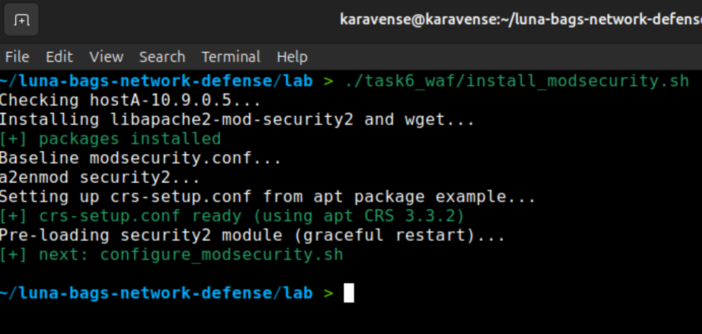
*install_modsecurity.sh: libapache2-mod-security2 installed, OWASP CRS v3.3.5 downloaded and extracted*

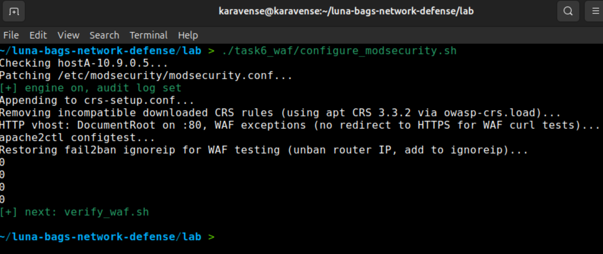
*configure_modsecurity.sh: SecRuleEngine set to On, audit log configured, CRS rules included, Apache restarted*

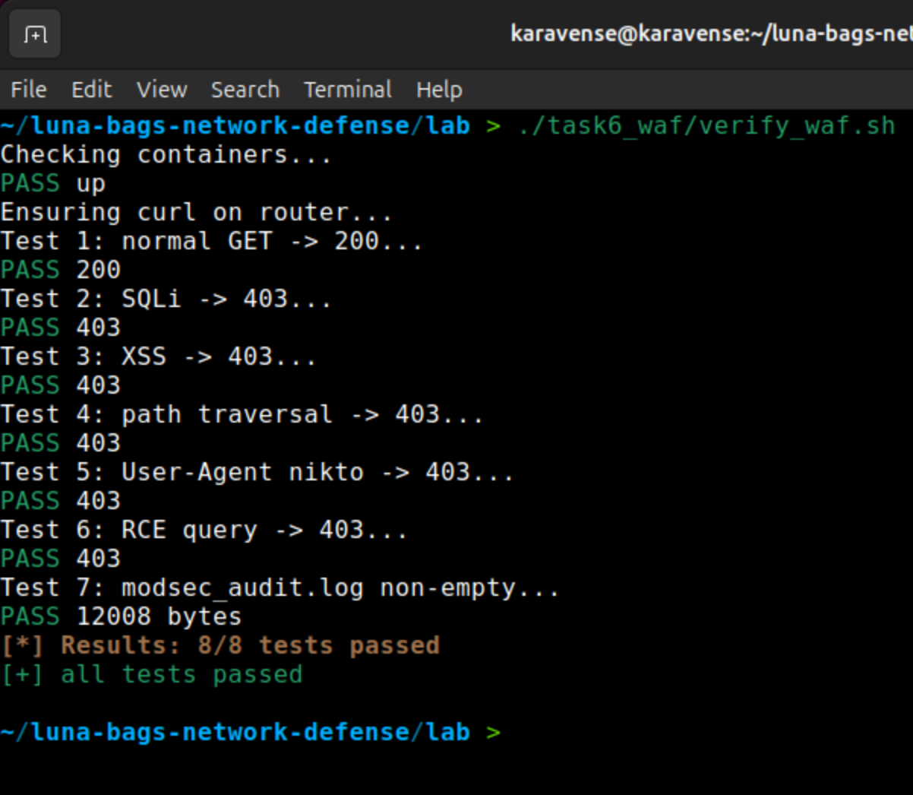
*verify_waf.sh: 7/7 tests — normal request 200, all 5 attack payloads return 403, audit log confirmed non-empty*

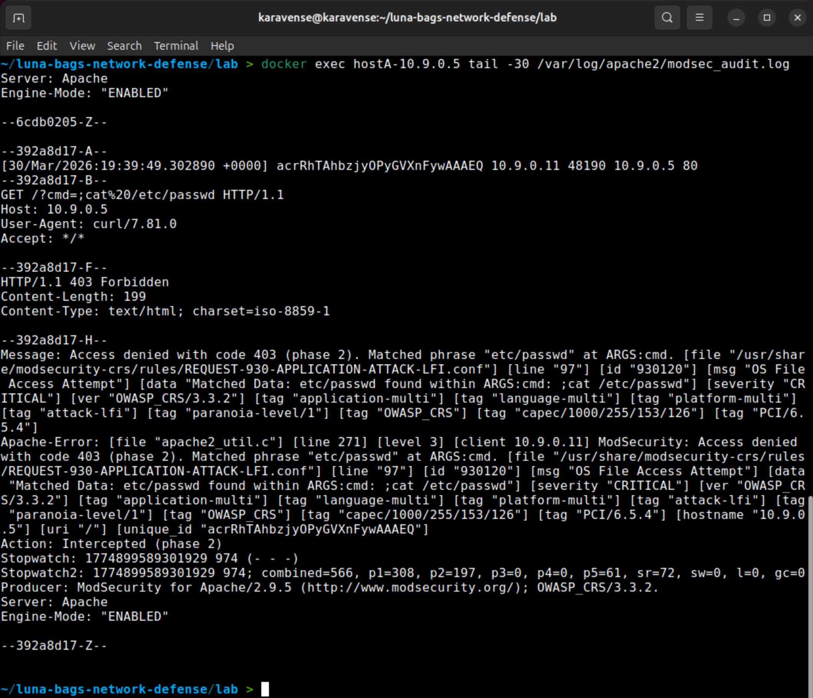
*modsec_audit.log tail: RCE payload blocked, rule 930120 matched, Engine-Mode ENABLED confirmed*

---

## Security Posture: Before vs After

The table below captures the full delta between the unprotected baseline and the hardened state after all six tasks are complete.

| Security Dimension | Baseline (Before) | Hardened State (After) |
|---|---|---|
| **Web server** | Not running | Apache 2.4, HTTPS enforced, HTTP 301 redirect |
| **Server identity** | Would expose version string | `Server: Apache` — version stripped |
| **Encryption** | No TLS anywhere | Self-signed cert, TLS on all connections |
| **Security headers** | None | HSTS (1yr), X-Frame-Options DENY, CSP default-src 'self', nosniff, XSS filter, Referrer-Policy |
| **Directory listing** | Would expose file structure | Returns 403 on all directorless paths |
| **Telnet** | Port 23 open across all hosts | REJECT on all hosts, REJECT on router FORWARD |
| **Firewall policy** | All traffic permitted | Default DROP on INPUT and FORWARD |
| **Zone isolation** | DMZ has full access to internal | DMZ→Internal completely blocked at router |
| **Inbound filter** | No restrictions | HTTP/HTTPS to hostA only; all else dropped |
| **SYN flood** | No protection | hashlimit 40/s burst 80 to hostA; excess dropped |
| **ICMP flood** | No protection | hashlimit 2/s burst 5 on internal→DMZ; excess dropped |
| **Port scanning** | All scan types succeed | NULL / FIN / Xmas / invalid flag combos dropped |
| **IP spoofing** | Spoofed RFC1918 sources accepted | Dropped at router INPUT chain |
| **DNS amplification** | UDP/53 oversized replies pass | UDP/53 > 512 bytes dropped |
| **Reverse shell ports** | 4444–4555 open | Blocked both directions on FORWARD |
| **Cross-zone access** | Any protocol, any host | WireGuard VPN only — requires cryptographic key |
| **Brute force** | No detection or response | Fail2Ban: SSH (3/60s), Apache auth (5/60s), badbots (1 hit = 24h ban) |
| **Scanner bots** | Undetected | Fail2Ban apache-badbots — one request, immediate 24h ban |
| **SQL Injection** | Reaches application | ModSecurity CRS rule 942 → HTTP 403, logged |
| **Cross-Site Scripting** | Reaches application | ModSecurity CRS rule 941 → HTTP 403, logged |
| **Path Traversal / LFI** | Reaches application | ModSecurity CRS rule 930 → HTTP 403, logged |
| **Remote Code Execution** | Reaches application | ModSecurity CRS rule 932 → HTTP 403, logged |
| **Attack audit trail** | None | iptables LOG, modsec_audit.log, fail2ban.log — all active |

---

## Limitations and Residual Risks

**Self-signed certificates** — encryption is equivalent to CA-signed; the trust chain is not. Production deployment replaces with Let's Encrypt or organization CA.

**Application-layer logic flaws** — ModSecurity blocks known attack signatures. Zero-day vulnerabilities in custom application code are not covered. Regular penetration testing is required.

**Container security** — Docker container escape, seccomp profiles, and AppArmor are out of scope. Required for a production deployment.

**Centralized logging** — logs currently write to container filesystems. A production deployment ships to a centralized SIEM before an attacker can tamper with them.

**NIDS** — network-level intrusion detection (Snort, Wazuh, Suricata) was not implemented in this engagement. Recommended as a follow-on task that would complement the host-based Fail2Ban detection already in place.

---

*Developed by Alister A. Rodrigues. All testing conducted in an isolated lab environment.*
